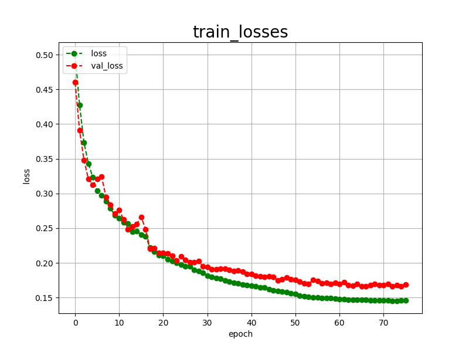

<h2>Tensorflow-Image-Segmentation-Multiple-Sclerosis-Brain-MRI-T1 (2024/09/23)</h2>
<li>2024/09/22: Retrained Multiple-Sclerosis model by enabling an early stopping callback.</li>
 
This is the first experiment of Image Segmentation for Multiple-Sclerosis-Brain-MRI-T1 
 based on
the <a href="https://github.com/sarah-antillia/Tensorflow-Image-Segmentation-API">Tensorflow-Image-Segmentation-API</a>, and
Pre-Augmented <a href="https://drive.google.com/file/d/1yj1vS8w9_F1XVm6oCTfiwxOKAru9ZEk4/view?usp=sharing">
Multiple-Sclerosis-Brain-MRI-T1-ImageMask-Dataset.zip</a>, which was derived by us from <a href="https://data.mendeley.com/datasets/8bctsm8jz7/1">
Brain MRI Dataset of Multiple Sclerosis with Consensus Manual Lesion Segmentation and Patient Meta Information 
</a>
  
On detail of the ImageMaskDataset, please refer to  
<a href="https://github.com/sarah-antillia/ImageMask-Dataset-Multiple-Sclerosis-Brain-MRI">
ImageMask-Dataset-Multiple-Sclerosis-Brain-MRI
</a>
 

<b>Actual Image Segmentation for Images of 512x512 pixels</b> 
As shown below, the inferred masks look similar to the ground truth masks.  

<table>
<tr>
<th>Input: image</th>
<th>Mask (ground_truth)</th>
<th>Prediction: inferred_mask</th>
</tr>
<tr>
<td></td>
<td></td>
<td></td>
</tr>

<tr>
<td></td>
<td></td>
<td></td>
</tr>

<tr>
<td></td>
<td></td>
<td></td>
</tr>

</table>

 
In this experiment, we used the simple UNet Model 
<a href="./src/TensorflowUNet.py">TensorflowSlightlyFlexibleUNet</a> for this Multiple-Sclerosis-Brain-MRI-T1 Segmentation Model. 
As shown in <a href="https://github.com/sarah-antillia/Tensorflow-Image-Segmentation-API">Tensorflow-Image-Segmentation-API</a>.
you may try other Tensorflow UNet Models: 

<li><a href="./src/TensorflowSwinUNet.py">TensorflowSwinUNet.py</a></li>
<li><a href="./src/TensorflowMultiResUNet.py">TensorflowMultiResUNet.py</a></li>
<li><a href="./src/TensorflowAttentionUNet.py">TensorflowAttentionUNet.py</a></li>
<li><a href="./src/TensorflowEfficientUNet.py">TensorflowEfficientUNet.py</a></li>
<li><a href="./src/TensorflowUNet3Plus.py">TensorflowUNet3Plus.py</a></li>
<li><a href="./src/TensorflowDeepLabV3Plus.py">TensorflowDeepLabV3Plus.py</a></li>

 

 
<h3>1. Dataset Citation</h3>
We used the following dataset to create our ImageMask dataset 
<a href="https://data.mendeley.com/datasets/8bctsm8jz7/1">
Brain MRI Dataset of Multiple Sclerosis with Consensus Manual Lesion Segmentation and Patient Meta Information 
</a>
 
Published: 31 March 2022|Version 1|DOI:10.17632/c
 

<b>Contributor:</b>Ali M Muslim
 
<b>Description:</b> 
Magnetic resonance imaging (MRI) provides a significant key to diagnose and monitor the progression of Multiple Sclerosis (MS) disease. Manual MS-Lesion segmentation, Expanded Disability Status Scale (EDSS) and patient’s meta information can provide a gold standard for research in terms of automated MS-lesion quantification, automated EDSS prediction and identification of the correlation between MS-lesion and patient disability. In this dataset, we provide a novel multi-sequence MRI dataset of 60 MS patients with consensus manual lesion segmentation, EDSS, general patient information and clinical information. On this dataset, three radiologists and neurologist experts segmented and validated the manual MS-lesion segmentation for three MRI sequences T1-weighted, T2-weighted and fluid-attenuated inversion recovery (FLAIR). The dataset can be used to study the relationship between MS-lesion, EDSS and patient clinical information. Furthermore, it also can be used to development of automated MS-lesion segmentation, patient disability prediction using MRI and correlation analysis between patient disability and MRI brain abnormalities include MS lesion location, size, number and type. 
 
<b>Licence:</b> CC BY 4.0 
 
 
<h3>
<a id="2">
2 Multiple-Sclerosis-Brain-MRI-T1 ImageMask Dataset
</a>
</h3>
 If you would like to train this BigBrain Segmentation model by yourself,
 please download the dataset from the google drive 
<a href="https://drive.google.com/file/d/1lnwZ_lQ9OUBUkEHsJBVZScmLSBk8Obsk/view?usp=sharing">
Multiple-Sclerosis-Brain-MRI-T1-ImageMask-Dataset.zip</a>, expand the downloaded ImageMaskDataset and put it under <b>./dataset</b> folder to be
<pre>
./dataset
└─Multiple-Sclerosis-Brain-MRI-T1
    ├─test
    │   ├─images
    │   └─masks
    ├─train
    │   ├─images
    │   └─masks
    └─valid
        ├─images
        └─masks
</pre>

<b>Multiple-Sclerosis-Brain-MRI-T1 Dataset Statistics</b> 
 
 
As shown above, the number of images of train and valid datasets is enough to use for a training set of our segmentation model.
  

 
<b>Train_images_sample</b> 

 
<b>Train_masks_sample</b> 

 

<h3>
3 Train TensorflowUNet Model
</h3>
 We trained Multiple-Sclerosis-Brain-MRI-T1 TensorflowUNet Model by using the following
<a href="./projects/TensorflowSlightlyFlexibleUNet/Multiple-Sclerosis-Brain-MRI-T1/train_eval_infer.config"> <b>train_eval_infer.config</b></a> file.  
Please move to ./projects/TensorflowSlightlyFlexibleUNet/Multiple-Sclerosis-Brain-MRI-T1 and run the following bat file. 
<pre>
>1.train.bat
</pre>
, which simply runs the following command. 
<pre>
>python ../../../src/TensorflowUNetTrainer.py ./train_eval_infer.config
</pre>

<b>Model parameters</b> 
Defined a small <b>base_filters</b> and large <b>base_kernels</b> for the first Conv Layer of Encoder Block of 
<a href="./src/TensorflowUNet.py">TensorflowUNet.py</a> 
and a large num_layers (including a bridge between Encoder and Decoder Blocks).
<pre>
[model]
model           = "TensorflowUNet"
generator       = False
image_width     = 512
image_height    = 512
image_channels  = 3
input_normalize = False
normalization   = False
num_classes     = 1
base_filters    = 16
base_kernels    = (9,9)
num_layers      = 8
</pre>

<b>Learning rate</b> 
Defined a small learning rate.  
<pre>
[model]
learning_rate  = 0.00007
</pre>

<b>Online augmentation</b> 
Disabled our online augmentation.  
<pre>
[model]
generator     = False
</pre>

<b>Loss and metrics functions</b> 
Specified "bce_dice_loss" and "dice_coef". 
<pre>
[model]
loss           = "bce_dice_loss"
metrics        = ["dice_coef"]
</pre>
<b>Learning rate reducer callback</b> 
Enabled learing_rate_reducer callback, and a small reducer_patience.
<pre> 
[train]
learning_rate_reducer = True
reducer_factor        = 0.4
reducer_patience      = 4
</pre>

<b>Early stopping callback</b> 
Enabled an early stopping callback with patience parameter.
<pre>
[train]
patience      = 10
</pre>

<b>Epoch change inference callbacks</b> 
Enabled epoch_change_infer callback. 
<pre>
[train]
epoch_change_infer       = True
epoch_change_infer_dir   =  "./epoch_change_infer"
epoch_changeinfer        = False
epoch_changeinfer_dir    = "./epoch_changeinfer"
num_infer_images         = 1
</pre>

By using these callbacks, on every epoch_change, the inference procedures can be called
 for an image in <b>mini_test</b> folder. These will help you confirm how the predicted mask changes 
 at each epoch during your training process.    

<b>Epoch_change_inference output</b> 
 
 
 

In this experiment, the training process was stopped at epoch 76 by the early stopping callback.  
 
 

 
<a href="./projects/TensorflowSlightlyFlexibleUNet/Multiple-Sclerosis-Brain-MRI-T1/eval/train_metrics.csv">train_metrics.csv</a> 
 

 
<a href="./projects/TensorflowSlightlyFlexibleUNet/Multiple-Sclerosis-Brain-MRI-T1/eval/train_losses.csv">train_losses.csv</a> 
 

 

<h3>
4 Evaluation
</h3>
Please move to a <b>./projects/TensorflowSlightlyFlexibleUNet/Multiple-Sclerosis-Brain-MRI-T1</b> folder, 
and run the following bat file to evaluate TensorflowUNet model for Multiple-Sclerosis-Brain-MRI-T1. 
<pre>
./2.evaluate.bat
</pre>
This bat file simply runs the following command.
<pre>
python ../../../src/TensorflowUNetEvaluator.py ./train_eval_infer_aug.config
</pre>

Evaluation console output: 

  

<a href="./projects/TensorflowSlightlyFlexibleUNet/Multiple-Sclerosis-Brain-MRI-T1/evaluation.csv">evaluation.csv</a> 

The loss (bce_dice_loss) to this Multiple-Sclerosis-Brain-MRI-T1/test was low, but dice_coef low as shown below.
 
<pre>
loss,0.1666
dice_coef,0.6804
</pre>

<h3>
5 Inference
</h3>
Please move to a <b>./projects/TensorflowSlightlyFlexibleUNet/Multiple-Sclerosis-Brain-MRI-T1</b> folder 
,and run the following bat file to infer segmentation regions for images by the Trained-TensorflowUNet model for Multiple-Sclerosis-Brain-MRI-T1. 
<pre>
./3.infer.bat
</pre>
This simply runs the following command.
<pre>
python ../../../src/TensorflowUNetInferencer.py ./train_eval_infer_aug.config
</pre>

<b>mini_test_images</b> 
 
<b>mini_test_mask(ground_truth)</b> 
 

<b>Inferred test masks</b> 
 
 

<b>Enlarged images and masks </b> 

<table>
<tr>
<th>Image</th>
<th>Mask (ground_truth)</th>
<th>Inferred-mask</th>
</tr>

<tr>
<td></td>
<td></td>
<td></td>
</tr>
<tr>
<td></td>
<td></td>
<td></td>
</tr>
<tr>
<td></td>
<td></td>
<td></td>
</tr>

<tr>
<td></td>
<td></td>
<td></td>
</tr>

<tr>
<td></td>
<td></td>
<td></td>
</tr>

</table>

 
<h3>
References
</h3>
<b>1. Brain MRI dataset of multiple sclerosis with consensus manual lesion segmentation and patient meta information</b> 
Ali M. Muslim, Syamsiah Mashohor, Gheyath Al Gawwam, Rozi Mahmud, Marsyita binti Hanafi, 
Osama Alnuaimi, Raad Josephine, Abdullah Dhaifallah Almutairi 
https://doi.org/10.1016/j.dib.2022.108139 

<a href="https://www.sciencedirect.com/science/article/pii/S235234092200347X">https://www.sciencedirect.com/science/article/pii/S235234092200347X</a>
 
 
<b>2. Multiple Sclerosis Lesion Segmentation in Brain MRI Using Inception Modules Embedded in a Convolutional Neural Network</b> 
Shahab U. Ansari, Kamran Javed, Saeed Mian Qaisar, Rashad Jillani, Usman Haider 
First published: 04 August 2021 https://doi.org/10.1155/2021/4138137 
<a href="https://onlinelibrary.wiley.com/doi/10.1155/2021/4138137?msockid=3ec756cfd5d167d7342f47c9d4de66ff">https://onlinelibrary.wiley.com/doi/10.1155/2021/4138137?msockid=3ec756cfd5d167d7342f47c9d4de66ff</a>
 
 
<b>3. Multiple Sclerosis Lesions Segmentation Using Attention-Based CNNs in FLAIR Images</b> 
Mehdi Sadeghibakhi, Hamidreza Pourreza, and Hamidreza Mahyar 
<a href="https://www.ncbi.nlm.nih.gov/pmc/articles/PMC9191687/">https://www.ncbi.nlm.nih.gov/pmc/articles/PMC9191687/</a>
 
 
<b>4. Improving automated multiple sclerosis lesion segmentation with a cascaded 3D convolutional neural network approach</b> 
Sergi Valverde, Mariano Cabezas, Eloy Roura, Sandra González-Villà, Deborah Pareto, Joan C. Vilanova,  
Lluís Ramió-Torrentà, Àlex Rovira, Arnau Oliver, Xavier Lladó 
<a href="https://www.sciencedirect.com/science/article/pii/S1053811917303270">https://www.sciencedirect.com/science/article/pii/S1053811917303270</a>
 
 
<b>5. Boosting multiple sclerosis lesion segmentation through attention mechanism</b> 
SAlessia Rondinella, Elena Crispino, Francesco Guarnera, Oliver Giudice, Alessandro Ortis, Giulia Russo,  
Clara Di Lorenzo, Davide Maimone, Francesco Pappalardo, Sebastiano Battiato 
https://doi.org/10.1016/j.compbiomed.2023.107021 
<a href="https://www.sciencedirect.com/science/article/pii/S0010482523004869?via%3Dihub">https://www.sciencedirect.com/science/article/pii/S0010482523004869?via%3Dihub</a>
 
 
<b>6. New multiple sclerosis lesion segmentation and detection using pre-activation U-Net</b> 
Pooya Ashtari, Berardino Barile, Sabine Van Huffel,Dominique Sappey-Marinier 
<a href="https://www.frontiersin.org/journals/neuroscience/articles/10.3389/fnins.2022.975862/full">
https://www.frontiersin.org/journals/neuroscience/articles/10.3389/fnins.2022.975862/full</a>
 
 
<b>7. Tensorflow-Image-Sementation-Multiple Sclerosis</b> 
Toshiyuki Arai @antillia.com 
<a href="https://github.com/sarah-antillia/Tensorflow-Image-Segmentation-Multiple-Sclerosis">
https://github.com/sarah-antillia/Tensorflow-Image-Segmentation-Multiple-Sclerosis
</a>
 
 
<b>8. Tensorflow-Image-Segmentation-Multiple-Sclerosis-Brain-MRI-Flair</b> 
Toshiyuki Arai @antillia.com 
<a href="https://github.com/sarah-antillia/Tensorflow-Image-Segmentation-Multiple-Sclerosis-Brain-MRI-Flair">
https://github.com/sarah-antillia/Tensorflow-Image-Segmentation-Multiple-Sclerosis-Brain-MRI-Flair</a>
 

